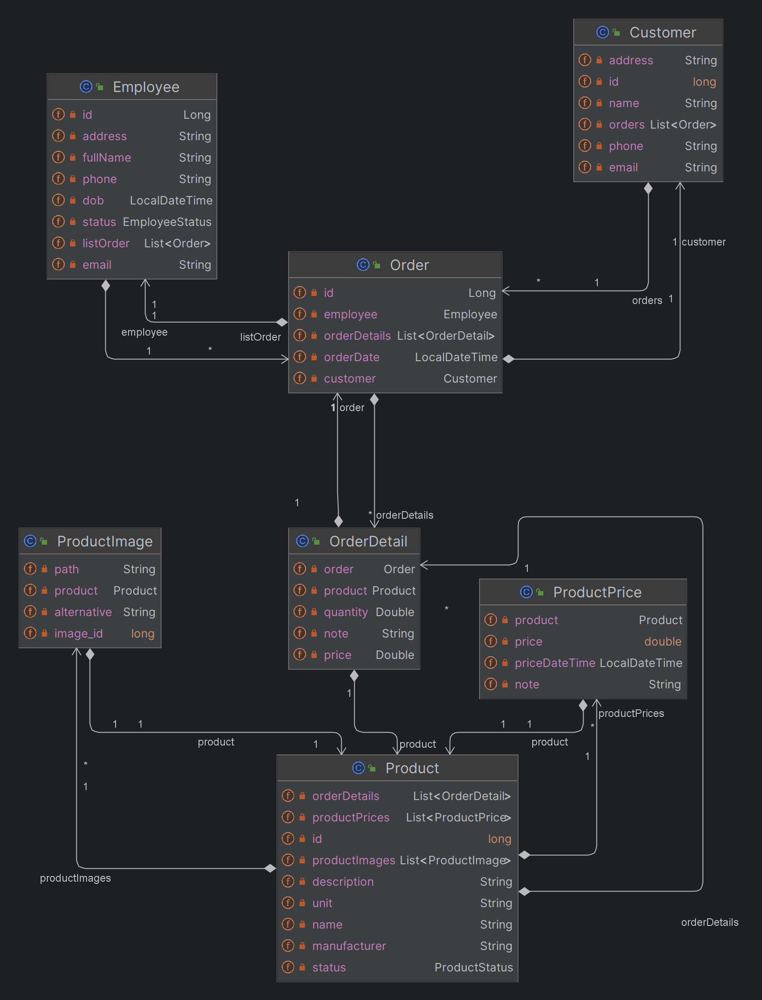

# REST API Jakarta EE
  

- **Ý tưởng:** Lập 1 trang web bán hàng.  
- **Sử dụng:** `REST API Jakarta EE` , `JSP + JSTL`  
 

**Diagram:**

  

 

**Class**

  
<h3>👇 Back end</h3> 

  
  ## BACK-END
  > GET
  > POST
  > PUT
  > DELETE

  
<h3>👇 Front end </h3> 

  
  ## FRONT-END 
- Tạo giao diện trang web bán hàng.  
- Sử dụng: `Servlet Jakarta EE`  
- Mô tả: 
  - Chạy song song với phần backend ở trên để lấy dữ liệu  

